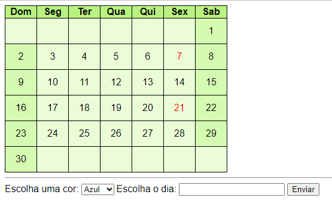

* [Projeto calendario](#🗓️calendario)  
* [Descrição](#descrição)    
* [Funcionalidades](#funcionalidades)  
* [Tecologias utilizadas](#tecologias-utilizadas)  
* [Fontes consultadas](#fontes-consultadas)  
* [Autores](#autores)  

# 🗓️Calendario
Projeto criado em sala de aula com ajuda do Professor Leonardo Santiago Sidon da Rocha.

#### 💻Capa do projeto

## 📄Descrição 
O prjeto consiste em um calendario virtual que qualquer pessoa pode acessar atravez de seu smartphone ou computador.
Possui apenas um mes

## 👾Funcionalidades
Adicionar cor a datas no calendario;
##### Tabela de cores
* 💙Azul
* 💚Verde 
* 💗Rosa 
* 💜Roxo  

### 🤖Tecologias utilizadas
* HTML5
* CSS
* VsCode (Visual Code)
* JavaScript
* GitHub
## 🔗Fontes consultadas
* Chat gpt
* Google
## ✒️Autores
Juan Fernandes Goes de Souza

## Colaboradores
Leonardo Santiago Sidon da Rocha.