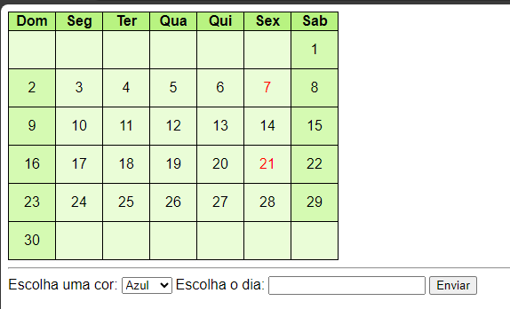
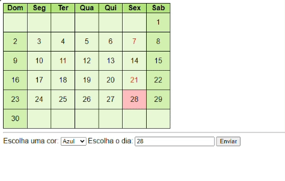

# 🗓️Calendario
Projeto criado em sala de aula com ajuda do Professor Leonardo Santiago Sidon da Rocha.

* [Projeto calendario](#calendario)
* [Capa do projeto](#capa-do-projeto)  
* [Descrição](#descrição)    
* [Funcionalidades](#funcionalidades)
* [Como Usar](#como-usar)  
* [Tecologias utilizadas](#tecologias-utilizadas)  
* [Fontes consultadas](#fontes-consultadas)  
* [Autores](#autores)  
## 🖼️Capa do projeto 

## 📄Descrição 
O prjeto consiste em um calendario virtual que qualquer pessoa pode acessar atravez de seu smartphone ou computador.
(Possui apenas um mes)
## 👾Funcionalidades
Escolher cor para adicionar em um dia especifico do mês;
Selecionar data;
Aplicar cor a data selecionada;
## 📸Como Usar

##### Tabela de cores
* 💙Azul
* 💚Verde 
* 💗Rosa 
* 💜Roxo  

### 🤖Tecologias utilizadas
* HTML 5
* CSS 3
* VsCode (Visual Code)

## 🔧Ferramentas utilizadas
* JavaScript
* GitHub
## 🔗Fontes consultadas
* Chat gpt
* Google
* https://www.alura.com.br/

## 🤜🤛Colaboradores
Leonardo Santiago Sidon da Rocha.

## ✒️Autores
Juan Fernandes Goes de Souza